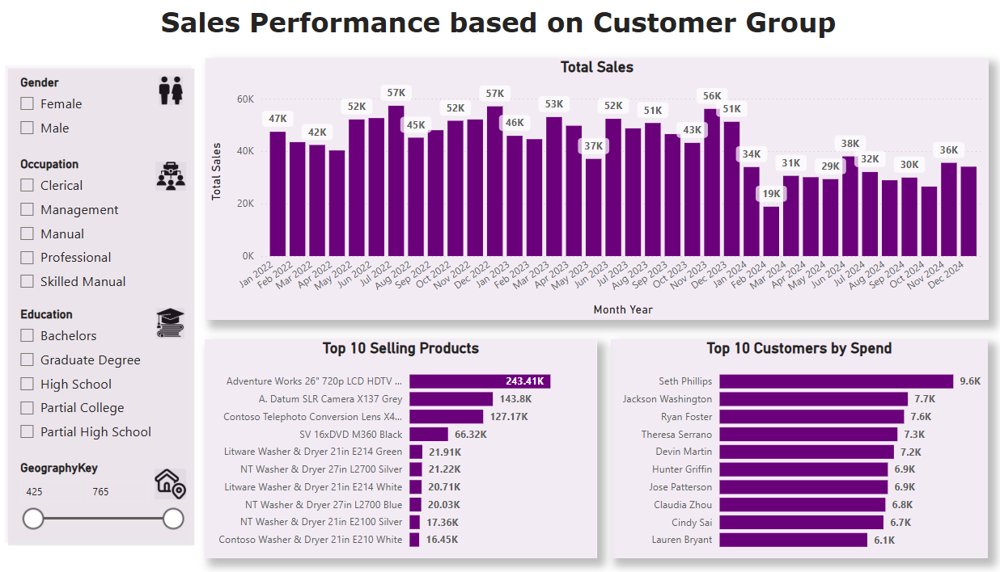

# Retail Business Intelligence Solution

This project develops a comprehensive Business Intelligence (BI) solution for an online retail electronics company experiencing declining sales performance. Utilising data from the Contoso BI Demo Dataset, the solution integrates multiple data sources to identify root causes of sales decline and provide actionable insights for business recovery.

## Objectives  

- Identify root causes of declining sales trends
- Uncover underperforming products and geographic regions
- Analyse customer segment behavior and churn patterns
- Evaluate marketing campaign effectiveness
- Predict future sales trends for strategic planning
- Optimise marketing spend and enhance customer retention

## Technical Architecture

- Data Sources: Microsoft Contoso BI Demo Dataset (Sales, Customers, Products, Returns, Expenses, Stock)
- ETL Pipeline: Microsoft Azure SQL Server → Python (data cleaning) → MySQL (data warehouse)
- Analytics Platform: Microsoft Power BI
- Data Model: Star schema with centralised Date table for time-based analysis

## Key Technologies

- Database: Microsoft Azure SQL Server, MySQL Workbench
- Data Processing: Python 3.12.3 (pandas, data manipulation libraries)
- Visualisation: Microsoft Power BI 2.142.928.0
- Architecture: Multi-layered approach (Data Integration → Storage → Analytics → Visualisation)

## Data Processing Pipeline

- Extraction: SQL queries from Contoso dataset (6 main tables)
- Transformation: Python-based cleaning, standardization, and feature engineering
- Loading: Structured data warehouse with established relationships
- Analytics: DAX measures and calculated columns for advanced KPIs
- Visualization: Interactive dashboards with dynamic filtering capabilities

## Dashboard Features

- Sales Performance Over Time: Monthly trends with returns analysis

- Customer Segmentation: Demographic-based performance tracking

- Customer Data: Demographics information

- Returns & Profitability: Top performers vs. high-return products

- Expenses & Profitability: Annual Expenses 

- Expense Management: Departmental cost tracking and profitability

- Predictive Analytics: Future sales forecasting

- KPI Overview: Comprehensive business metrics dashboard

## Key Insights

- Sales Trend: Consistent 3-year decline requiring immediate intervention
- Customer Loyalty: 7-15% monthly churn rate indicates stable but improvable retention
- Return Analysis: High return rates on specific products signal quality/delivery issues
- Cost Management: Rising expenses amid declining sales are impacting profitability
- Future Outlook: Predictive models show continued decline without strategic changes

## Recommendations

- Implement targeted promotions and discounts for underperforming products
- Expand social media presence and explore new geographic markets
- Address quality issues for high-return products
- Launch customer retention programs to reduce churn
- Optimize operational expenses across departments

## Authors

**Nikolaos Gkmpenompa**  
Charleen Pierrette Mange  
Yassin Kedir Simea  

Higher Diploma in Science in Data Analytics  
National College of Ireland
